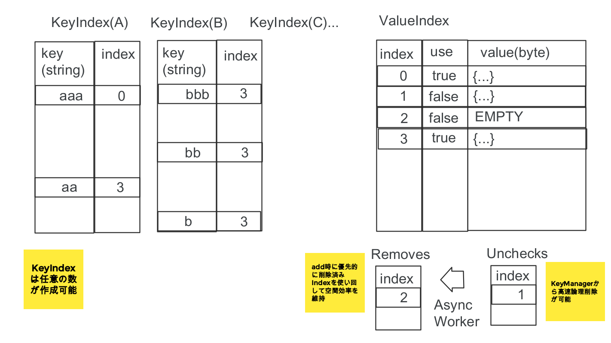
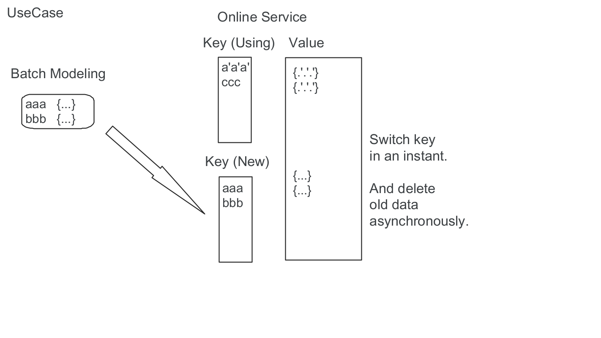

KKKVS(Work In Progress) [](https://travis-ci.org/ksgwr/KKKVS) [](https://ci.appveyor.com/project/ksgwr/kkkvs/branch/master)
=====

# Design



# Usecase



# Install

```
$ pip install -i https://test.pypi.org/simple/ kkkvs
```

# Setup

```
$ git submodule update -i
(if cmake/DownloadProject is empty)
```

# Build

```
$ mkdir build
$ cd build
$ cmake ..
$ make
$ make VERBOSE=1
$ make test
$ make test ARGS='-V'
$ make install
```
